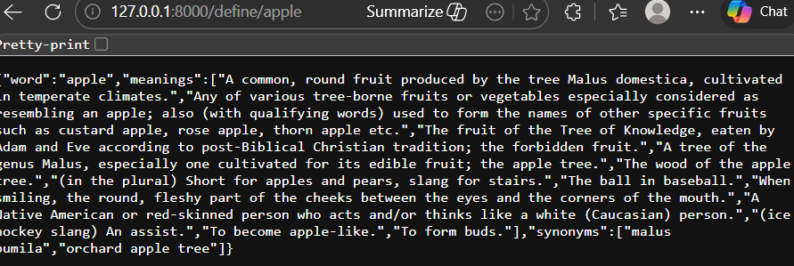
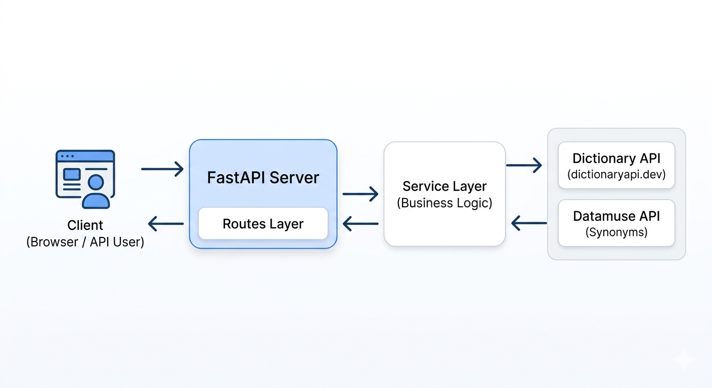

# 📖 Dictionary API

A modular **FastAPI-based REST API** to fetch word meanings and synonyms using external APIs like DictionaryAPI and Datamuse.

---

## 🚀 Features

* Fetch word meanings
* Retrieve synonyms
* FastAPI interactive docs (Swagger UI)
* Clean architecture (routes, services, utils)
* Scalable and easy to extend

---

## 📸 Demo / Preview



---

## 🧪 Interactive API Docs

FastAPI provides built-in docs:

👉 http://127.0.0.1:8000/docs
---

## 🏗️ Project Structure

```id="v7f7wb"
dictionary-api/
│
├── app/
│   ├── routes/        # API endpoints
│   ├── services/      # Business logic
│   ├── utils/         # External API calls
│   └── config/        # Settings
│
├── tests/             # Unit tests
├── run.py             # Entry point
├── requirements.txt
└── README.md
```

---

## ⚙️ Installation

### 1. Clone the repository

```bash id="eq1njf"
git clone https://github.com/gopal092003/Dictionary-API.git
cd Dictionary-API
```

---

### 2. Create virtual environment (recommended)

```bash id="e4xyku"
python -m venv venv
venv\Scripts\activate      # Windows
```

---

### 3. Install dependencies

```bash id="a9l1kk"
pip install -r requirements.txt
```

---

## ▶️ Run the Application

```bash id="2x6r5o"
python run.py
```

Server will start at:

```id="4bgn0f"
http://127.0.0.1:8000
```

---

## 🔌 API Endpoints

### ➤ Health Check

```id="4x1j6p"
GET /
```

---

### ➤ Define a Word

```id="8w41uh"
GET /define/{word}
```

**Example:**

```id="7dx1k5"
/define/apple
```

---

## 📊 Example Response

```json id="m3l98m"
{
  "word": "apple",
  "meanings": [
    "A common, round fruit produced by the tree Malus domestica."
  ],
  "synonyms": [
    "orchard apple tree",
    "malus pumila"
  ]
}
```

---

## 📊 API Workflow



---

## 🌐 External APIs Used

* Dictionary API (dictionaryapi.dev)
* Datamuse API (for synonyms)

---

## ⚠️ Error Handling

| Status Code | Description           |
| ----------- | --------------------- |
| 404         | Word not found        |
| 500         | Internal server error |

---

## 🧪 Running Tests

```bash id="u1ax4r"
pytest
```

*(or use unittest if configured)*

---

## 📦 Dependencies

* FastAPI
* Uvicorn
* Requests

---

## 🔮 Future Improvements

* Add antonyms endpoint
* Add phonetics and pronunciation
* Add caching (Redis / in-memory)
* Deploy to cloud (Render / AWS)

---

## 👨‍💻 Author

**Gopal Gupta**

* GitHub: https://github.com/gopal092003

---

## ⭐ Support

If you like this project:

* ⭐ Star the repo
* 🍴 Fork it
* 🚀 Use it in your own apps

---